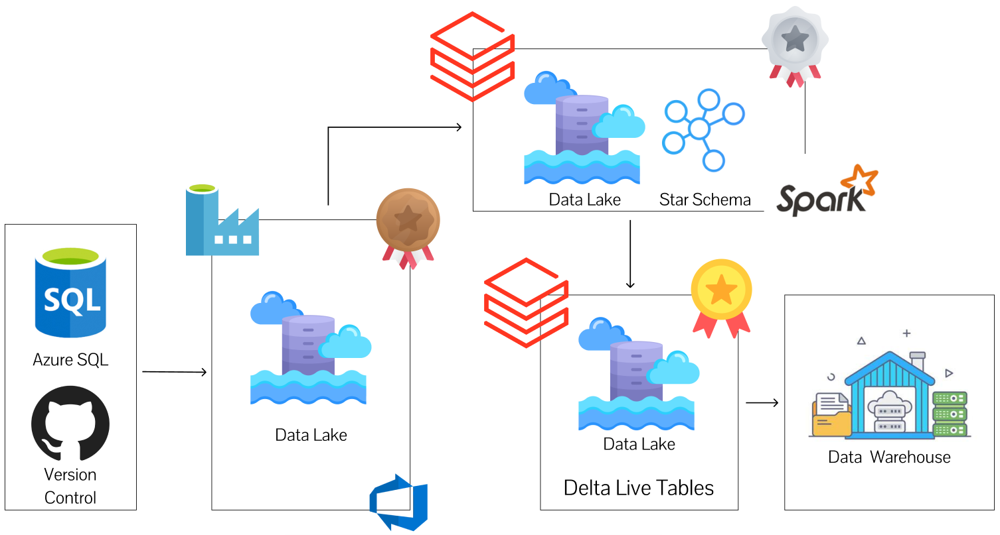

# Spotify Data Pipeline

## Introduction
An end-to-end data engineering project on **Microsoft Azure** that ingests music data, processes it with **Azure Databricks**, and produces **analytics-ready tables** using a modern lakehouse approach (Medallian Architecture).

> ✅ This repo includes a **versioned sample dataset** in `dataset/`, so you can run the pipeline end-to-end **without needing external API keys**. If you want live extraction later, you can plug in the Spotify Web API as an optional extension.

## System Architecture


## Repository Structure
```text
.
├── .github/
│   └── workflows/
│       └── deploy.yml
├── .vscode/
│   ├── __builtins__.pyi
│   ├── extensions.json
│   └── settings.json
├── Jinja/
│   └── jinja_notebook.ipynb
├── dataset/
│   ├── azure_sql.json
│   ├── json_dynamic.json
│   └── parquet_dynamic.json
├── factory/
│   └── df-agazureproject.json
├── linkedService/
│   ├── azure_datalake.json
│   └── azure_sql.json
├── pipeline/
│   ├── incremental_ingestion.json
│   └── incremental_loop.json
├── resources/
│   ├── agspotifyazure_dab_etl.pipeline.yml
│   └── sample_job.job.yml
├── src/
│   ├── gold/
│   │   └── dlt/
│   │       ├── transformations/
│   │       │   ├── DimDate.py
│   │       │   ├── DimTrack.py
│   │       │   ├── DimUser.py
│   │       │   └── FactStream.py
│   │       └── utilities/
│   │           └── utils.py
│   └── silver/
│       └── silver_dim_processing.ipynb
├── utils/
│   └── transformations.py.ipynb
├── .gitignore
├── README.md
├── databricks.yml
├── publish_config.json
└── pyproject.toml
```

## Technologies
- Microsoft Azure
  - Azure Data Factory (ADF)
  - Azure Data Lake Storage Gen2 (ADLS)
  - Azure SQL (optional serving)
  - Azure Logic Apps (optional: auth/token refresh / scheduling)
- Azure Databricks
  - PySpark
  - Auto Loader
  - Delta Lake
  - Delta Live Tables / Lakeflow Declarative Pipelines
  - Unity Catalog
- Data formats: JSON, Parquet, Delta
- CI/CD: GitHub Actions, Databricks Asset Bundles (`databricks.yml`)
